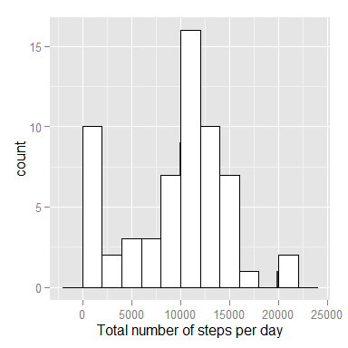
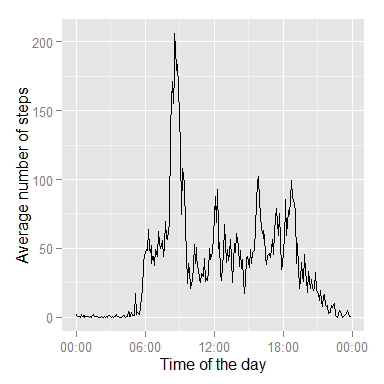
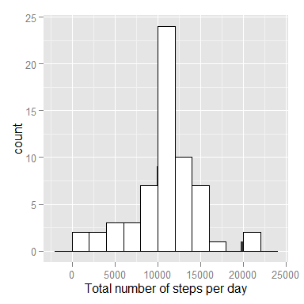
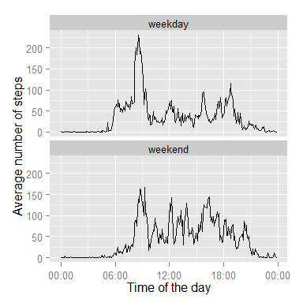

# Reproducible Research: Peer Assessment 1
opts_chunk$set(echo=TRUE)

## Loading and preprocessing the data
Data are get from [GitHub repository](http://github.com/rdpeng/RepData_PeerAssessment1) created for this assignment (file *activity.zip*) on January 17, 2015.


```r
unzip('activity.zip')
data <- read.csv('activity.csv')
```

It is convenient to have time variable. Let's add it to data frame. 

```r
GetTime <- function(x){
    x.hours <- ifelse(x == 0, 0, ceiling(x/100)-1)
    x.minutes <- x-x.hours*100
    as.POSIXct(paste(x.hours, x.minutes, sep = ':'), format = "%H:%M")
}
data$time <- GetTime(data$interval)
```


## What is mean total number of steps taken per day?
Let's calculate total number of steps taken by person per day.


```r
steps.perday <- tapply(data$steps, data$date, sum, na.rm = TRUE)
steps.perday.mean <- round(mean(steps.perday))
steps.perday.median <- median(steps.perday) 
```

We get on average 9354 steps. Median number of steps is 10395.  
How  is distributed total number of steps per day? Let's look at histogram:


```r
library(ggplot2)
P <- qplot(steps.perday, xlab = 'Total number of steps per day')
P + geom_histogram(binwidth = 2000, colour="black", fill="white")
```

```
## stat_bin: binwidth defaulted to range/30. Use 'binwidth = x' to adjust this.
```




## What is the average daily activity pattern?
In order to make plot showing daily activity pattern of the person let's calculate average number of steps for every time interval.


```r
library(plyr)
daily.activity <- ddply(data, .(time), function(x) mean(x$steps, na.rm = TRUE))
daily.activity <- rename(daily.activity, c(V1 = 'steps.mean')) 
```

Now the graph can be created.


```r
library(scales)
P <- ggplot(daily.activity, aes(time, steps.mean))
P <- P + geom_line() + xlab('Time of the day') + ylab('Average number of steps')
P + scale_x_datetime(labels = date_format(format = "%H:%M"))
```



As can be seen from the graph above person is most active on early hours.  
Which 5-minute interval has maximum number of steps?


```r
id <- which(daily.activity$steps.mean == max(daily.activity$steps.mean, na.rm = T))
most.active <- format(daily.activity[id, "time"], "%H:%M")
```

It's 08:35.


## Imputing missing values
Note that there are a number of days/intervals where there are missing values.  
Calculate total number of missing values in dataset.


```r
count.NA <- length(which(is.na(data$steps)))
```

We have 2304 NA's. Let's change them with rounded average number of steps for corresponding time interval. 


```r
data.noNA <- merge(data, daily.activity)
data.noNA$steps <- ifelse(is.na(data.noNA$steps), 
                          round(data.noNA$steps.mean), 
                          data.noNA$steps)
```

Let's look again at mean, median and histogram for total number of steps per day.


```r
steps.perday.noNA <- tapply(data.noNA$steps, data.noNA$date, sum, na.rm = TRUE)
steps.perday.noNA.mean <- round(mean(steps.perday.noNA))
steps.perday.noNA.median <- median(steps.perday.noNA)

P <- qplot(steps.perday.noNA, xlab = 'Total number of steps per day')
P + geom_histogram(binwidth = 2000, colour="black", fill="white")
```

```
## stat_bin: binwidth defaulted to range/30. Use 'binwidth = x' to adjust this.
```



The number of average steps per day has increased from 9354 to 
10767. Median has changed from 10395 to 
10769. Imputing missing data has increased estimates of the total daily number of steps. 


## Are there differences in activity patterns between weekdays and weekends?
Continue working on dataset with filled-in missing values. Let's create a new factor variable indicating whether a given date is a weekday or weekend.

```r
DayType <- function(x){
    week.day <- weekdays(as.POSIXct(x))
    if (week.day %in% c("Saturday", "Sunday")){
        "weekend"                
    } else {
        "weekday"
    }
}

data.noNA$day.type <- as.factor(sapply(data.noNA$date, DayType))
```

Let's calculate average number of steps for every time interval for weekdays and weekends.


```r
daily.activity2 <- ddply(data.noNA, .(time, day.type), function(x) mean(x$steps, na.rm = TRUE))
daily.activity2 <- rename(daily.activity2, c(V1 = 'steps.mean')) 
```

Now the graph comparing daily activity patterns can be created.


```r
library(scales)
P <- ggplot(daily.activity2, aes(time, steps.mean))
P <- P + geom_line() + xlab('Time of the day') + ylab('Average number of steps')
P <- P + scale_x_datetime(labels = date_format(format = "%H:%M"))
P + facet_wrap(~day.type, ncol = 1)
```


